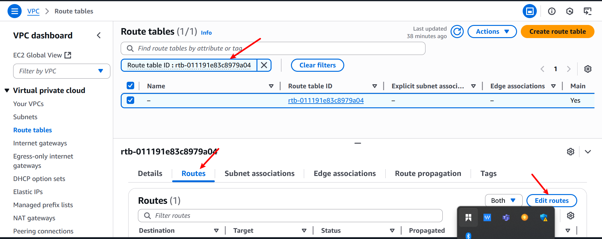
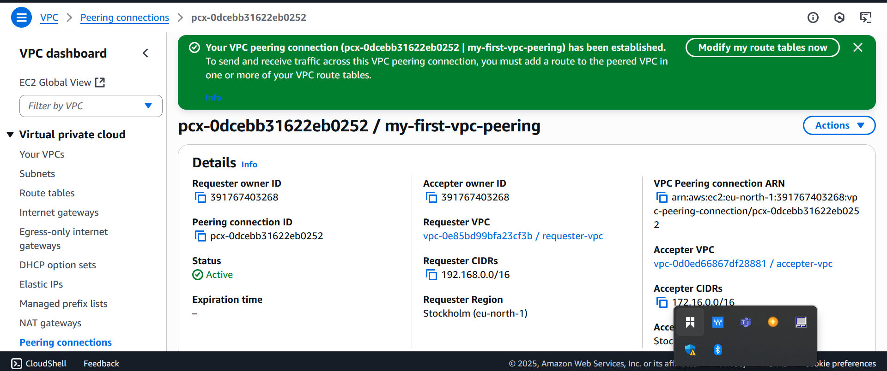

# AWS_Virtual_Private_Cloud 

# what is  VPC (Virtual Private Cloud)?
A VPC is your own private network inside AWS.

- Think of it as your own isolated data center.

- You define how networking works: IP ranges, subnets, gateways, etc.

- Default VPCs are created by AWS, but you can create custom ones.

# Subnet:
A subnet is a smaller segment inside a VPC.

- You break a VPC into subnets for organization and control.

## Types:
- Public subnet → can access the internet.
- Private subnet → cannot access internet directly.

#  Internet Gateway (IGW)
An Internet Gateway lets your VPC talk to the internet.

- Required for EC2s in public subnets to be accessible from the internet.

- Must be attached to the VPC and referenced in the route table.

#  NAT Gateway
A NAT Gateway allows instances in a private subnet to access the internet (for updates, downloads, etc.) — but they cannot be accessed from the internet.

- NAT = Network Address Translation.

- Placed in a public subnet, and referenced in the private subnet’s route table.

#  IP Address
An IP address is a unique number identifying a device on a network.

# Types:

- Public IP: Reachable over the internet.

- Private IP: Only reachable inside the VPC/local network.

# CIDR (Classless Inter-Domain Routing)
CIDR defines IP address blocks.

#  Gateway
A gateway is a connection point between networks

# Types
- Internet Gateway: Connects VPC to internet.

- NAT Gateway: Allows private subnet outbound internet access.

- Virtual Private Gateway: For connecting to on-premises networks (via VPN).

# Route Table
A route table tells traffic where to go.

Each subnet in your VPC uses one route table.
Contains rules like:

- 10.0.0.0/16 → local (stay within VPC)

- 0.0.0.0/0 → igw-abc123 (send internet traffic to internet gateway)

- 0.0.0.0/0 → nat-xyz456 (send internet traffic from private subnet to NAT)

#  Connection Between Route Table & Gateway
This is how AWS knows how traffic should flow:

1. If you want internet access:

- Attach an Internet Gateway to the VPC.

- Edit the route table to send 0.0.0.0/0 traffic to that gateway.

2. If you want private instances to reach internet:

- Set up a NAT Gateway in a public subnet.

- Update private subnet's route table to send 0.0.0.0/0 → NAT Gateway.

# Setting up VPC

# PART 1
1. Naviagte to the search bar
a. Search for VPC and click on it , it wil direct you to the virtual pivate cloud.
.

2. Naviagte to the create vpc option and click on it.
.

3. select the 'vpc' only option, specify the IPV4 CIDR block and proceed by clicking on proceed.
.

Your vpc was created successfully.
.

# PART 2.
1. Navigate to the subnets and click on create subnets
.

2. select the ID of the vpc you created in part 1
.

3. Now enter the subnet name , and specify the IPV4 CIDR for the subnets , choose the availability zone.
.

a. click on add subnets to create another subnets.
.

b. Repeat the same steps fo the second subnets.Once completed click on create .
.

Here you will see your subnets is being created.
.

# PART 3.
1. click on the internet Gateway option on the left sidebar and click create.
 .

2. provide the name for the internet Gateway and click create.
.

Now your internet Gateway has been successfully created 
.

To enable internet connectivity , you must attach the internet gateway to the vpc you have previously created .

Now , attach it
.

.

.

# PART 4.
1. Procedd to the route table option and create the route table 

2. provide a name of the route table and select the vpc you created previously. and click on route table .
.

Now your route table has been crated .
.

a. To associate the route table with subnets, click on subnet association. followed by edit subnet association. we will assiciate the public subnet with this route table .
.

3. choose the public subnets and click on save association.
.

4. Navigate to route and click on Eddit route.
.

5. click on add route.
.

6. select Destination 0.0.0.0/0 indicatong that every IPV4 address can access this subnets.

7. In the target field , choose internet gateway and then select the internet gateway you created and clik on save changes .
.

The route table has now been configured to route traffic to the internet gateway  , allowing connectivity to the internet . since only the subnets named my-public-subnet-1 is associated with this route table . therefore only resources within that subnet can access the internet .
 .

# PART 5.
1. Navigate to the NAT Gateways setion and click on create .

2. privide a name of the NAT gateways.choose the private subnets, select connectivity type as private.click on create NAT Gateway

3. Your NAT Gateway is being created successfully.
.

4. Select your NAT Gateway. Navigate to the Details Tab, locate subnet ID and click on it.
.

5. In the subnet page navigate to the Route Table setion.
.

6. proceed to route section and click on edit route.
.

7. click Add route.select Destination as 0.0.0.0/0, choose NAT Gateway in the Target field. then select the NAT Gateway you created and click save changes .

.

8. On the subnet association section , click on edit subnet association.
.

a. choose the private subnet ansd click on save association.
.

Now  that the subnet has been successfully attached with the route table.
 .

# Differences Between Internet Gateway and NAT Gateway.
INTERNET GATEWAY:
- Allows instances in a public subnet to access the internet and receive traffic from the internet
- Inbound & Outbound internet traffic

NAT GATEWAY:
- Allows instances in a private subnet to access the internet, but prevents incoming traffic from the internet
- Outbound only (from private subnet to internet)

#  What is VPC Peering?
VPC Peering is a networking connection between two Virtual Private Clouds (VPCs) in AWS that allows instances in both VPCs to communicate with each other as if they are on the same network.

#  Why Use VPC Peering
- Your app is split into multiple services in different VPCs — they need to talk to each other.
- You're using separate AWS accounts for dev, test, and prod — peering allows communication between their VPCs.
- Centralized services (like logging, monitoring, AD, DNS) in one VPC, accessed by others.
- Need to share data between teams or projects securely, without exposing it to the internet.

# PRACTICAL PART.

## PART 6.
1.Lets begin by creating two VPCs in the same region. Alternatively, you may choose a different region if you needed.

.

2. Navigate to the peering connection option . click on it and go create peering connection.
.

3. provide name for the peering connection vpc
a. select requester vpc 
b. choose tge account 'my account' since the vpc are in our aws account.
c. ensure to use  the same region 
d. select the accepter vpc
e. proceed by clicking on create peering connection button. 
.

.

Then , you will see this 
.

4. locate the action option and click on it , then select accept request.

.

.

5. Now click on main route table ID of the accepter VPC.

6. Choose route table and navigate to the route section, and click on edit route.
.

a. click on add route.
.

7. Go to VPC page. select requester vpc . in the detail tab , find and copy IPV4 CIDR and pase it in the Destination field when adding route.
.

a. In the target , choose vpc peering and choose the peering connection you have created and click on save changes.

8. Now , copy the IPV4 CIDR of the accepter vpc

9. Now click on main route table ID of the requester

10. choose a route table , then navigate to the route section. click on edit route. 
.

11. click on add route
.

a. paste CIDR in the destination field, in the target choose vpc peering and choose the peering connection you created.
.

The connection has been successfully established . Now, resources in the accepter vpc can connect to resources in the requester vpc and vice versa.
